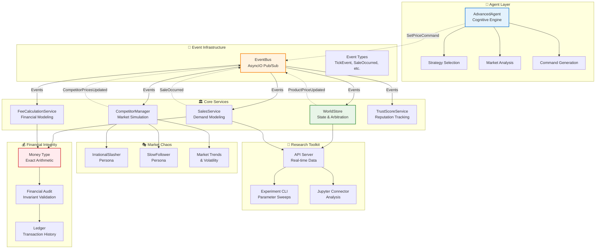

# FBA-Bench Implementation Plan (Revised)

This plan reflects the current state of FBA-Bench v3, which has evolved into a sophisticated **event-driven multi-agent simulation platform** with advanced market chaos simulation capabilities. The system now prioritizes cognitive agent architecture on top of a robust, financially-accurate simulation kernel.

## Current Implementation Status: Advanced Event-Driven Platform

FBA-Bench v3 has significantly surpassed the original plan, implementing a complete event-driven architecture with multi-agent capabilities, financial integrity, and high-fidelity market chaos simulation.

### ✅ **Already Implemented: Core Platform**

#### **Event-Driven Architecture (Complete)**
*   **EventBus** ([`event_bus.py`](event_bus.py)) - AsyncIO-based pub/sub with typed event routing
*   **Event Schema** ([`events.py`](events.py)) - Comprehensive event types: [`TickEvent`](events.py:66), [`SaleOccurred`](events.py:93), [`SetPriceCommand`](events.py:216), [`ProductPriceUpdated`](events.py:257), [`CompetitorPricesUpdated`](events.py:322)
*   **WorldStore** ([`services/world_store.py`](services/world_store.py)) - Centralized state management with command arbitration and conflict resolution

#### **Multi-Agent Framework (Complete)**
*   **AdvancedAgent** ([`agents/advanced_agent.py`](agents/advanced_agent.py)) - Sandboxed agents with command-arbitration-event pattern
*   **Agent Strategies** - Profit maximizer, market follower, aggressive pricer with pluggable strategy system
*   **Command Processing** - [`SetPriceCommand`](events.py:216) → [`WorldStore`](services/world_store.py) arbitration → [`ProductPriceUpdated`](events.py:257) events

#### **Financial Integrity System (Complete)**
*   **Money Type** - Strict financial arithmetic preventing floating-point errors
*   **Financial Audit** ([`financial_audit.py`](financial_audit.py)) - Real-time validation of accounting identities
*   **Fee Calculation** ([`services/fee_calculation_service.py`](services/fee_calculation_service.py)) - Comprehensive Amazon FBA fee modeling
*   **Trust Score System** ([`services/trust_score_service.py`](services/trust_score_service.py)) - Event-driven reputation tracking

#### **Advanced Market Simulation (Complete)**
*   **Sales Service** ([`services/sales_service.py`](services/sales_service.py)) - Sophisticated demand modeling with price elasticity
*   **Competitor Manager** ([`services/competitor_manager.py`](services/competitor_manager.py)) - Event-driven competitor simulation
*   **Competitor Personas** ([`personas.py`](personas.py)) - [`IrrationalSlasher`](personas.py:94), [`SlowFollower`](personas.py:220) with sophisticated behavior patterns
*   **High-Fidelity Chaos** - Stochastic demand, irrational competitors, market trend analysis

#### **Research Toolkit (Complete)**
*   **API Server** ([`api_server.py`](api_server.py)) - Real-time simulation data API
*   **Experiment CLI** ([`experiment_cli.py`](experiment_cli.py)) - High-throughput parameter sweeps
*   **Jupyter Connector** ([`jupyter_connector.py`](jupyter_connector.py)) - Read-only research interface

### 🔧 **Phase 1: Complete Cognitive Agent Architecture**
The platform needs advanced cognitive capabilities to enable sophisticated LLM-driven agents.

#### **Agent Memory & Learning System**
*   **LedgerService** - SQLite-based transactional ledger subscribing to financial events
*   **MemoryService** - Vector database for unstructured agent knowledge (strategic plans, market insights, competitor analysis)
*   **Knowledge Persistence** - Agent learning retention across simulation runs

#### **Agent Toolset & APIs**
*   **ToolUseModule** (`agents/tool_use_module.py`) - Comprehensive agent API toolkit:
    *   [`finance.get_pl_statement()`](agents/tool_use_module.py) and [`finance.get_balance_sheet()`](agents/tool_use_module.py)
    *   [`product.get_competitor_analysis()`](agents/tool_use_module.py) and [`product.get_market_trends()`](agents/tool_use_module.py)
    *   [`listing.update_price()`](agents/tool_use_module.py) and [`listing.optimize_content()`](agents/tool_use_module.py)
    *   [`strategic_planning.read_plan()`](agents/tool_use_module.py) and [`strategic_planning.update_plan()`](agents/tool_use_module.py)
*   **Tool Execution Framework** - Safe, sandboxed tool execution with result validation

### 🧠 **Phase 2: Advanced Cognitive Modules**
Build sophisticated reasoning and planning capabilities for autonomous agent operation.

#### **Hierarchical Planning System**
*   **PlanningModule** (`agents/planning_module.py`) - Goal decomposition into executable tool sequences
*   **Strategy Library** - Pluggable business strategies (launch product, optimize pricing, market expansion)
*   **Multi-Step Execution** - Complex goal achievement across multiple simulation ticks

#### **Reflection & Learning System**
*   **ReflectionModule** (`agents/reflection_module.py`) - OODA loop implementation
*   **Performance Analysis** - Compare actions against strategic objectives
*   **Market Intelligence** - Extract insights from competitor behavior and market trends
*   **Strategy Adaptation** - Dynamic strategy adjustment based on performance metrics

### 🚀 **Phase 3: Enhanced Simulation Capabilities**
Expand the simulation environment with advanced business scenarios and market dynamics.

#### **Supply Chain & Inventory Management**
*   **SupplyChainService** - Global supplier network simulation
*   **Inventory Management** - Stock levels, procurement, fulfillment dynamics
*   **Seasonal Demand** - Time-based demand fluctuations and external market shocks

#### **Advanced Marketing & Customer Simulation**
*   **AdvertisingService** - PPC campaign simulation with conversion tracking
*   **CustomerService** - Customer interactions, reviews, and satisfaction modeling
*   **Brand Management** - Brand equity simulation and reputation tracking

## Updated Architecture: Event-Driven Multi-Agent Platform

## Revised Implementation Roadmap

### **Immediate Priorities (Next 4 weeks)**

- [ ] **LedgerService Implementation**
    - [ ] SQLite schema design for transaction ledger
    - [ ] Event subscription to [`SaleOccurred`](events.py:93), fee events, inventory changes
    - [ ] Real-time P&L statement generation
    - [ ] Balance sheet calculation with asset/liability tracking

- [ ] **MemoryService & Vector Database**
    - [ ] Vector storage for agent knowledge and insights
    - [ ] Strategic plan persistence and retrieval
    - [ ] Market intelligence knowledge base
    - [ ] Agent learning history tracking

- [ ] **ToolUseModule Foundation**
    - [ ] Tool interface definition and execution framework
    - [ ] Financial reporting tools (`get_pl_statement`, `get_balance_sheet`)
    - [ ] Market analysis tools (`get_competitor_analysis`, `get_market_trends`)
    - [ ] Strategic planning tools (`read_plan`, `update_plan`)

### **Cognitive Architecture (Weeks 5-8)**

- [ ] **PlanningModule Development**
    - [ ] Goal decomposition algorithms
    - [ ] Multi-step strategy execution
    - [ ] Resource allocation and constraint handling
    - [ ] Goal prioritization and scheduling

- [ ] **ReflectionModule Implementation**
    - [ ] OODA loop (Observe-Orient-Decide-Act) cycle
    - [ ] Performance metrics analysis
    - [ ] Strategy effectiveness evaluation
    - [ ] Adaptive learning from market feedback

### **Advanced Features (Weeks 9-12)**

- [ ] **Enhanced Business Simulation**
    - [ ] Supply chain complexity with multiple suppliers
    - [ ] Seasonal demand patterns and external shocks
    - [ ] Customer segment modeling and behavior
    - [ ] Brand equity and reputation dynamics

- [ ] **LLM Agent Integration**
    - [ ] LLM-powered cognitive agents using tool APIs
    - [ ] Natural language strategic planning
    - [ ] Adaptive strategy generation
    - [ ] Multi-agent collaboration scenarios

## Key Innovations Already Achieved

1. **Event-Driven Purity** - Complete separation of concerns through async event architecture
2. **Financial Integrity** - Uncompromising monetary accuracy with audit validation
3. **High-Fidelity Chaos** - Realistic market irrationality through competitor personas
4. **Multi-Agent Sandboxing** - Agents interact only through commands and events
5. **Research-Grade Observability** - Real-time data access for analysis and experimentation

## Success Metrics

- **Cognitive Agent Autonomy**: Agents successfully execute multi-step business strategies
- **Market Realism**: Simulation generates realistic market dynamics and price discovery
- **Financial Accuracy**: Zero accounting errors with real-time audit validation
- **Research Utility**: Platform supports reproducible experiments and insight generation
- **Extensibility**: New agent strategies and market scenarios can be easily implemented

This revised plan positions FBA-Bench v3 as a cutting-edge **cognitive agent research platform** built on a foundation of financial integrity and market realism.