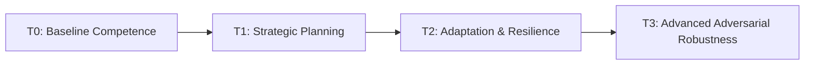
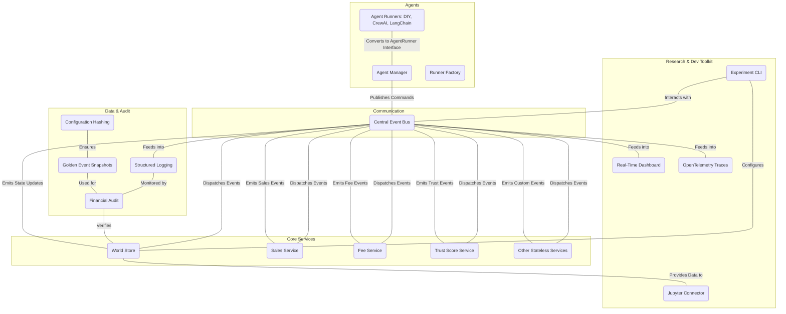

# 🚀 FBA-Bench: A LLM Agent Benchmark for Amazon FBA Simulations

## Evaluating Autonomous Agents in Complex E-commerce Environments

**Disclaimer**: This project, including its codebase and documentation (such as this README), was developed with significant assistance from advanced AI models (specifically Claude and Gemini). The author, Bender1011001, is not a professional coder, and this novel development approach means that while every effort has been made to ensure accuracy and functionality, there may be unforeseen nuances or minor inaccuracies. This project serves as an experimental exploration of AI-assisted software engineering.

[](https://github.com/your-org/fba-bench/actions/workflows/main.yml)
[](https://opensource.org/licenses/MIT)
[](https://www.python.org/)
[](https://discord.gg/your-discord-invite)

---

## 💡 Executive Summary

FBA-Bench is a paradigm-shifting, **tier-1 LLM-agent benchmark** designed to rigorously evaluate the long-horizon, multi-role competence and robustness of AI agents operating in a high-fidelity, simulated Amazon FBA (Fulfillment by Amazon) e-commerce environment. Moving beyond traditional static evaluations, FBA-Bench immerses agents in dynamic market conditions, stochastic shocks, and adversarial pressures, all while enforcing **uncompromising financial integrity** and **bit-perfect deterministic reproducibility**.

This platform provides a crucible where agents must demonstrate sustained coherence, strategic reasoning, and cognitive resilience over extended simulated timeframes. With its event-driven architecture, comprehensive research toolkit (including a real-time dashboard and experiment CLI), framework-agnostic agent support, and a gradient-of-difficulty curriculum (T0-T3), FBA-Bench sets a new standard for assessing autonomous AI in real-world economic scenarios.

---

## ✨ Key Features

FBA-Bench is engineered to address the most pressing challenges in autonomous agent evaluation, offering a robust and comprehensive platform with the following distinctive features:

### 🔬 **Research-Grade Benchmarking**
- **Tier-1 Benchmark Status**: Designed to meet the highest standards for LLM-agent evaluation, on par with leading benchmarks like VendingBench and AgentBench.
- **Deterministic Reproducibility**: Guarantees bit-perfect identical results across runs given the same configuration and seed, enabling rigorous scientific experimentation.
- **Multi-dimensional Scoring**: Evaluates agents across 7 critical domains: Finance, Operations, Marketing, Trust, Cognitive Resilience, Stress Recovery, and Cost, providing a holistic view of performance.
- **Gradient-of-Difficulty Curriculum (T0-T3)**: A tiered system that progressively challenges agents with increasing complexity, constraints, and adversarial pressures, testing sustained competence over long horizons.

### 💼 **High-Fidelity Business Simulation**
- **Uncompromising Financial Integrity**: Enforces strict accounting identities (`Assets = Liabilities + Equity`) after every transaction, halting simulation on any violation.
- **Multi-Agent Competition**: Simulates realistic e-commerce market dynamics with sandboxed agents interacting via a central event bus, preventing privileged information access.
- **High-Fidelity Chaos**: Incorporates stochastic demand, irrational competitor personas, and external shocks (e.g., supply chain disruptions, regulatory changes) for true-to-life market volatility.
- **Long-horizon Coherence**: Prioritizes sustained strategic reasoning and consistent decision-making over weeks of simulated time, unlike short-term task-focused evaluations.

### 🛠️ **Integrated Research & Development Toolkit**
- **Real-Time Dashboard**: A React-based frontend for live monitoring of simulation KPIs, agent activity, and system health.
- **Experiment CLI**: A powerful command-line interface for defining, running, and aggregating large-scale parameter sweeps and automated experiments.
- **Jupyter Connectivity (Observer Mode)**: Provides read-only access to simulation data, enabling in-depth analysis with Pandas and Matplotlib.
- **Framework-Agnostic Agent Abstraction**: Supports seamless integration of diverse LLM agent frameworks including DIY, CrewAI, and LangChain, and is easily extensible for future frameworks.
- **OpenTelemetry Instrumentation**: Provides detailed traces of agent decisions and system events for advanced debugging and performance analysis.

### 🛡️ **Adversarial Testing & Security Assessment**
- **Red Team Framework**: A dedicated system for injecting multi-vector adversarial exploits (phishing, market manipulation, compliance traps) to evaluate agent resistance.
- **Adversary Resistance Score (ARS)**: Quantifies an agent's security awareness and resilience against sophisticated attacks.
- **Community Exploit Catalog**: Standardized format for contributing and sharing new exploit scenarios, fostering collaborative security research.

---

## ▶️ Quick Start

This section provides a quick guide to running FBA-Bench.

### 1. Launch the Full FBA-Bench Stack (API Server + Frontend Dashboard + Basic Simulation)

Ensure you are in the project root directory (`fba-bench/`):

```bash
# Launch the API server, frontend dashboard, AND a basic Tier-0 simulation concurrently
npm run dev:all
```

Once running, open your browser to `http://localhost:5173` for the FBA-Bench Dashboard, which will display real-time metrics from the running simulation.

### 2. Run Additional Simulations (Optional)

If you wish to run additional simulations or different scenarios while the stack is already running, you can do so from a new terminal:

```bash
# Open a new terminal from the fba-bench/ directory
python experiment_cli.py run scenarios/tier_0_baseline.yaml
```

This will start a new simulation run, and you will see real-time updates on the FBA-Bench Dashboard.

#### Default `scenarios/tier_0_baseline.yaml` Example:

```yaml
# A simple Tier-0 baseline scenario for basic agent evaluation
simulation:
  duration_days: 7
  start_date: 2025-01-01
  initial_capital: 1000.00
  base_product_demand: 100
  profit_margin_percent: 0.30

agents:
  - id: "my_baseline_agent"
    framework: "diy"
    config:
      agent_type: "greedy_script"
      target_asin: "B0EXAMPLE"
```

### 3. Run Integration Tests

To validate the core functionality and ensure all components are working as expected:

```bash
# From the fba-bench/ directory
python integration_tests/run_integration_tests.py --quick
```

---

## 📚 Multi-Tier Curriculum System (T0-T3)

FBA-Bench features a progressive, gradient-of-difficulty curriculum designed to systematically evaluate agents under increasing complexity, constraints, and adversarial pressure. This ensures that agents are tested for their sustained competence over long time horizons, moving beyond isolated task completion.



### Tier Descriptions:

*   **T0: Baseline Competence** (e.g., GPT-4o should pass):
    *   **Agent Context Window**: 8k tokens
    *   **Memory Aids**: None
    *   **Shocks**: Off
    *   **Purpose**: Sanity checks for basic FBA operations and fundamental decision-making in a stable market.
*   **T1: Strategic Planning**:
    *   **Agent Context Window**: 16k tokens
    *   **Memory Aids**: Vector Database
    *   **Shocks**: Weekend demand oscillation
    *   **Purpose**: Tests the agent's ability to formulate and execute strategies over a 7+ day horizon, adapting to predictable market fluctuations.
*   **T2: Adaptation & Resilience**:
    *   **Agent Context Window**: 32k tokens
    *   **Memory Aids**: Vector Database + Scratchpad
    *   **Shocks**: Fee hike + supplier delay
    *   **Purpose**: Stresses the agent's cash flow and supply chain management, evaluating its adaptive capacity and resilience to unexpected disruptions.
*   **T3: Advanced Adversarial Robustness**:
    *   **Agent Context Window**: 128k tokens
    *   **Memory Aids**: Full Retrieval Augmented Generation (RAG)
    *   **Shocks**: Review-bomb + listing hijack + fee hike chain
    *   **Purpose**: Evaluates cognitive resilience and adversarial resistance against cascading failures and sophisticated red-team exploits.

---

## 🏗️ System Architecture

FBA-Bench operates on a robust event-driven, service-oriented hybrid architecture designed for scalability, financial integrity, and research-grade observability.



### Core Components:

*   **Central Event Bus**: Asynchronous publish/subscribe mechanism for all inter-component communication (`event_bus.py`).
*   **World Store**: Canonical source of market state, maintaining versioned snapshots (`services/world_store.py`).
*   **Services**: Stateless micro-services (e.g., `SalesService`, `FeeCalculationService`, `TrustScoreService`) that consume events, run business logic, and emit new events.
*   **Agent Manager & Runners**: Provides a framework-agnostic interface for various LLM agents (DIY, CrewAI, LangChain), managing their lifecycle and translating simulation state (`agent_runners/`).
*   **Real-Time Dashboard**: A web-based frontend for live monitoring and visualization of simulation data (`frontend/`).
*   **Experiment CLI**: Command-line tool for orchestrating large-scale simulation runs and parameter sweeps (`experiment_cli.py`).
*   **Financial Audit**: Enforces strict financial integrity, validating `Assets = Liabilities + Equity` after every transaction (`financial_audit.py`).
*   **OpenTelemetry Tracing**: Provides detailed event lineage and debugging capabilities (`instrumentation/tracer.py`).

---

## 📊 Evaluation & Metrics

FBA-Bench employs a sophisticated, multi-dimensional scoring system to provide a holistic and granular evaluation of agent performance. The final score (0-100) is a weighted aggregate of performance across seven critical domains:

| Domain | Weight | Description | Responsible Module |
|---|---|---|---|
| **Finance** | 25% | Net Worth, Profitability, Cash Flow Management | [`metrics/finance_metrics.py`](metrics/finance_metrics.py) |
| **Operations** | 15% | Inventory Turn, Stock-out Rate, Fulfillment Efficiency | [`metrics/operations_metrics.py`](metrics/operations_metrics.py) |
| **Marketing** | 10% | Return on Ad Spend (ROAS), Customer Acquisition Cost (ACoS) | [`metrics/marketing_metrics.py`](metrics/marketing_metrics.py) |
| **Trust/Compliance** | 10% | Policy Adherence, Violation-free Days, Buyer Feedback | [`metrics/trust_metrics.py`](metrics/trust_metrics.py) |
| **Cognitive Resilience** | 15% | Sustained Attention, Adaptability to Novelty, Internal Coherence | [`metrics/cognitive_metrics.py`](metrics/cognitive_metrics.py) |
| **Stress Recovery** | 15% | Mean Time to Recovery (MTTR) after injected shocks | [`metrics/stress_metrics.py`](metrics/stress_metrics.py) |
| **Cost Efficiency** | -5% | Token Usage, LLM API Costs | [`metrics/cost_metrics.py`](metrics/cost_metrics.py) |

All metrics are computed offline from the immutable event log, ensuring fair, objective, and reproducible evaluation. Results are provided via a standardized JSON output contract for easy integration with analysis tools.

```json
{
  "score": 78.5,
  "breakdown": {
    "finance": 20.1,
    "operations": 12.5,
    "marketing": 8.0,
    "trust": 9.2,
    "cognitive": 11.8,
    "stress_recovery": 10.9,
    "cost": -3.0
  },
  "cost_usd": 4.76,
  "token_usage": 2140567,
  "failure_modes_detected": ["state_misinterpretation", "hallucinatory_escalation"]
}
```

---

## 🧩 Agent Framework Integration

FBA-Bench is designed for maximum flexibility, allowing seamless integration with various LLM agent frameworks. The Agent Runners module provides a unified interface, enabling you to switch frameworks with minimal code changes.

### Supported Frameworks:

*   **DIY (Do-It-Yourself)**: Built-in, highly customizable agents for direct control and fine-tuning. Ideal for rapid prototyping and exploring novel agentic behaviors.
*   **CrewAI**: Supports multi-agent collaboration with specialized roles and hierarchical coordination.
*   **LangChain**: Enables complex reasoning chains, advanced memory systems, and a rich ecosystem of tools.

### Example: Registering a CrewAI Agent

```python
from agent_runners import AgentManager, CrewAIConfig
from event_bus import get_event_bus

async def register_crewai_agent_example():
    event_bus = get_event_bus()
    agent_manager = AgentManager(event_bus)
    await agent_manager.initialize()

    # Define CrewAI agent configuration
    crew_config = CrewAIConfig.standard_crew(
        agent_id="my_crewai_agent",
        api_key="YOUR_OPENAI_API_KEY", # or other LLM provider API key
        process="sequential",
        crew_size=3,
        roles=["pricing_specialist", "inventory_manager", "market_analyst"]
    )

    # Register the agent with the AgentManager
    runner = await agent_manager.register_agent(
        agent_id=crew_config.agent_id,
        framework="crewai",
        config=crew_config.to_dict()
    )
    print(f"CrewAI agent '{runner.agent_id}' registered successfully.")

if __name__ == "__main__":
    import asyncio
    asyncio.run(register_crewai_agent_example())
```

For more details on integrating custom agents or new frameworks, refer to the [`agent_runners/README.md`](agent_runners/README.md).

---

## 🔬 Research Capabilities

FBA-Bench is built from the ground up to support cutting-edge AI research, offering unparalleled capabilities for experimentation and analysis.

### Deterministic Reproducibility

Every FBA-Bench simulation run is 100% deterministically reproducible. This is ensured through:

*   **Global Seed Management**: A single `SimSeed` propagates to all randomness sources (`reproducibility/sim_seed.py`).
*   **Golden Event Snapshots**: Full event bus dumps after each CI build, used for regression testing and ensuring bit-perfect identical results (`reproducibility/event_snapshots.py`).
*   **Configuration Hashing**: SHA-256 fingerprints of environment, YAML config, and git tree, guaranteeing that `sha+config ⇒ identical results`.

### Advanced Instrumentation

Gain deep insights into agent behavior and system performance:

*   **OpenTelemetry Tracing**: Detailed spans for every agent turn (observe, think, tool call) and system operation, exportable to `chrome://tracing` for visual analysis (`instrumentation/tracer.py`).
*   **Structured Logging**: Comprehensive, searchable logs for all events and system activities.
*   **Cognitive Resilience Metrics**: Built-in metrics like Cognitive Resilience Assessment (CRA) and distress signals (`memory_experiments/memory_metrics.py`).

### Data Analysis & Experimentation

*   **Jupyter Connector (Observer Mode)**: Secure, read-only access to real-time and historical simulation data via Pandas DataFrames for in-depth statistical analysis and visualization (`jupyter_connector.py`).
*   **Experiment CLI**: Automate large-scale parameter sweeps, manage experiment runs, and aggregate results for systematic research (`experiment_cli.py`).
*   **Memory Experiment Framework**: Tools for ablating or saturating agent memory to study the impact of context and recall on long-horizon coherence (`memory_experiments/`).

---

## 🛡️ Adversarial Testing & Red Team Framework

FBA-Bench includes a robust Red Team Framework designed to systematically evaluate agent resistance to various exploit scenarios. This framework implements the **ARS (Adversary Resistance Score)** system, providing a quantitative measure of an agent's security awareness and resilience.

### Key Capabilities:

*   **Multi-Vector Attacks**: Supports diverse attack types including phishing, market manipulation, compliance traps, financial exploits, and information warfare.
*   **Community Exploit Catalog**: A standardized YAML format for defining and sharing new exploit scenarios, fostering collaborative security research (see [`redteam_scripts/README.md`](redteam_scripts/README.md)).
*   **Automated Gauntlet Testing**: Integration into CI/CD pipelines for automated execution of random exploit selections against agents.
*   **Detailed Reporting**: Provides comprehensive security analysis and recommendations based on ARS scoring.

### Example: Running a Red Team Scenario

```bash
# Run a specific adversarial scenario
python redteam/demo_adversarial_testing.py --scenario compliance_trap_fake_policy_v1.0.0.yaml

# Run a gauntlet of random exploits
python redteam/gauntlet_runner.py --num_exploits 5
```

---

## 📚 Documentation & Resources

Dive deeper into FBA-Bench with our comprehensive documentation:

*   **FBA-Bench v3 Master Blueprint**: [`fba_bench_blueprint_v_3.md`](fba_bench_blueprint_v_3.md) - The core design document outlining principles and architecture.
*   **FBA-Bench Implementation Plan**: [`FBA-Bench-Implementation-Plan.md`](FBA-Bench-Implementation-Plan.md) - Detailed roadmap and current status of the project.
*   **Benchmark Philosophy**: [`Benchmark Philosophy.md`](Benchmark%20Philosophy.md) - Establishes the philosophical foundation and evaluation criteria for FBA-Bench.
*   **LLM Agent Interface Contract**: [`docs/LLM_contract.md`](docs/LLM_contract.md) - Standardized interface and interaction protocols for external LLM agents.
*   **Integration Testing Suite**: [`integration_tests/README.md`](integration_tests/README.md) - Comprehensive module for validating tier-1 benchmark requirements.
*   **Agent Runners Abstraction**: [`agent_runners/README.md`](agent_runners/README.md) - Unified interface for different agent frameworks.
*   **Red Team Framework**: [`docs/red_team_framework.md`](docs/red_team_framework.md) - Details on adversarial testing and security assessment.
*   **Community Exploit Framework**: [`redteam_scripts/README.md`](redteam_scripts/README.md) - Standardized format for defining and sharing exploit scenarios.

---

## 🤝 Contributing

We welcome contributions to FBA-Bench! Whether you're interested in developing new agent strategies, creating novel market scenarios, enhancing assessment metrics, or improving the core platform, your contributions are invaluable.

### How to Contribute

1.  **Fork the Repository**: Start by forking the [FBA-Bench GitHub repository](https://github.com/your-org/fba-bench).
2.  **Clone Your Fork**: `git clone https://github.com/your-username/fba-bench.git`
3.  **Create a Branch**: `git checkout -b feature/your-feature-name`
4.  **Install Dev Dependencies**: `pip install -r requirements.txt -r requirements-dev.txt` (assuming `requirements-dev.txt` exists for dev tools like `black`, `ruff`, `pytest`)
5.  **Follow Coding Standards**: Ensure your code adheres to our style guidelines (e.g., using `black` for formatting and `ruff` for linting). Pre-commit hooks are recommended.
6.  **Add Tests**: All new features or bug fixes must be accompanied by comprehensive unit and/or integration tests.
7.  **Update Documentation**: Document your changes in relevant `README.md` files or other documentation. If applicable, update Golden Snapshots.
8.  **Submit Pull Request**: Push your branch and open a PR to the `main` branch of `your-org/fba-bench`. Clearly describe your changes and their impact.

### Development Setup

*   **Pre-commit Hooks**:
    ```bash
    pip install pre-commit
    pre-commit install
    ```
    This ensures `black` and `ruff` are run automatically before each commit.
*   **Design Discussions**: Join our GitHub Discussions for architectural decisions and feature proposals. Use our ADR (Architectural Decision Record) template.

---

## 🚀 Performance Benchmarks & System Requirements

FBA-Bench is designed for efficient execution and scalability. Here are some key performance targets and recommended system requirements:

### Performance Targets:

| Metric | Target | Validation |
|---|---|---|
| **Simulation Speed (T0)** | 1000 ticks/minute | Integration tests |
| **Memory Usage (3 agents)** | <2GB RAM | Integration tests |
| **API Response Time** | <500ms | Integration tests |
| **Dashboard Updates** | <100ms | Integration tests |
| **Concurrent Agents** | 10+ simultaneous | Integration tests |
| **Reproducibility** | 100% bit-perfect | Integration tests |

### Minimum System Requirements:

*   **Processor**: Dual-core CPU (e.g., Intel i5 or equivalent)
*   **RAM**: 8GB
*   **Storage**: 5GB free disk space (for logs and artifacts)
*   **Operating System**: Linux, macOS, or Windows

### Recommended System for Research:

*   **Processor**: Quad-core CPU with high clock speed (e.g., Intel i7/i9 or AMD Ryzen 7/9)
*   **RAM**: 16GB - 32GB (for large-scale parameter sweeps)
*   **Storage**: 50GB+ NVMe SSD (for faster I/O)
*   **Operating System**: Linux (Ubuntu 20.04+ recommended) or macOS
*   **Docker/Podman**: For containerized agent environments (optional, but recommended for advanced setups)

---

## ❓ Troubleshooting & Support

Encountering an issue? Here are some common problems and resources for help:

### Common Issues:

*   **`ImportError`**: Ensure all Python dependencies are installed (`pip install -r requirements.txt`). Check your `PYTHONPATH` if running scripts outside the project root.
*   **Frontend Not Loading/Connecting**:
    *   Ensure both the API server and frontend are running (`npm run dev:all`).
    *   Check browser console for WebSocket connection errors.
    *   Verify API server is accessible at `http://localhost:8000`.
*   **Simulation Freezes/Stalls**:
    *   Check for fatal errors in terminal output or logs.
    *   Ensure LLM API keys are correctly configured and have sufficient balance.
    *   Increase LLM context window or reduce simulation complexity if agents are consistently hitting token limits.
*   **Reproducibility Failures**:
    *   Ensure you are using the exact same code, configuration (`.yaml` files), and `SimSeed`.
    *   Verify all random number generators are seeded from the global `SimSeed`.

### Getting Help:

*   **GitHub Issues**: For bug reports, feature requests, or technical questions, open an [issue on our GitHub repository](https://github.com/your-org/fba-bench/issues).
*   **GitHub Discussions**: For broader discussions, design proposals, or seeking community advice, visit our [GitHub Discussions page](https://github.com/your-org/fba-bench/discussions).
*   **Discord Community**: Join our [Discord server](https://discord.gg/your-discord-invite) for real-time support, collaboration, and community updates.
---

## 📝 License, Citation, & Acknowledgments

### License

This project is licensed under the MIT License - see the [`LICENSE`](LICENSE) file for details. Note a potential amber-light clause for simulation output used in commercial ML training.

<details>
  <summary>Click to view License</summary>

```
MIT License

Copyright (c) [Year] [Your Name or Organization]

Permission is hereby granted, free of charge, to any person obtaining a copy
of this software and associated documentation files (the "Software"), to deal
in the Software without restriction, including without limitation the rights
to use, copy, modify, merge, publish, distribute, sublicense, and/or sell
copies of the Software, and to permit persons to whom the Software is
furnished to do so, subject to the following conditions:

The above copyright notice and this permission notice shall be included in all
copies or substantial portions of the Software.

THE SOFTWARE IS PROVIDED "AS IS", WITHOUT WARRANTY OF ANY KIND, EXPRESS OR
IMPLIED, INCLUDING BUT NOT LIMITED TO THE WARRANTIES OF MERCHANTABILITY,
FITNESS FOR A PARTICULAR PURPOSE AND NONINFRINGEMENT. IN NO EVENT SHALL THE
AUTHORS OR COPYRIGHT HOLDERS BE LIABLE FOR ANY CLAIM, DAMAGES OR OTHER
LIABILITY, WHETHER IN AN ACTION OF CONTRACT, TORT OR OTHERWISE, ARISING FROM,
OUT OF OR IN CONNECTION WITH THE SOFTWARE OR THE USE OR OTHER DEALINGS IN THE
SOFTWARE.
```
</details>

For more detailed licensing information, especially regarding commercial use of simulation output, please refer to the main `LICENSE` file.

### Citation

If you use FBA-Bench in your academic or research work, please cite it as:

```bibtex
@article{FBABench,
  title={FBA-Bench: A Tier-1 LLM Agent Benchmark for Amazon FBA Simulations},
  author={[Your Names/Organization]},
  year={2025},
  publisher={arXiv:future-submission-id-here},
  url={https://github.com/your-org/fba-bench}
}
```

### Acknowledgments

We extend our gratitude to the creators of VendingBench and AgentBench for their foundational work in LLM agent evaluation. FBA-Bench draws inspiration from their pioneering efforts, aiming to push the boundaries of autonomous agent assessment in complex, real-world economic environments.

Special thanks to all contributors, early testers, and community members for their invaluable feedback and dedication.

---
