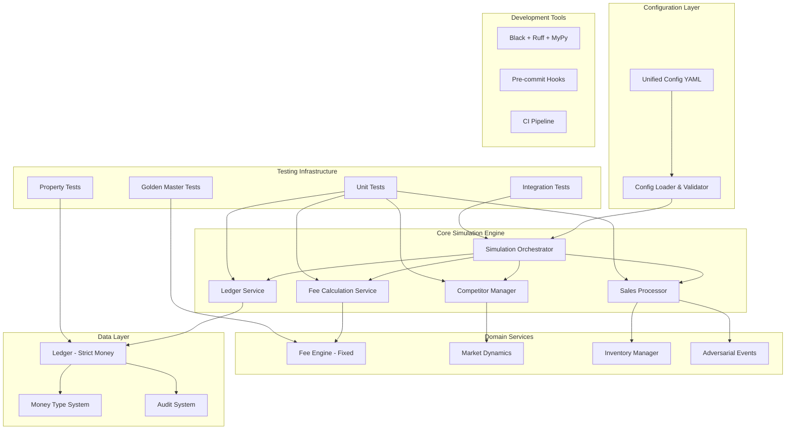

# FBA-Bench Refactoring Plan

## Overview

This plan addresses the maintainability and code quality issues identified in the FBA-Bench codebase review. The focus is on developer experience, testing, and long-term maintainability.

## Architecture Vision

## Key Changes

### Before vs After

**Monolithic Structure → Focused Services**
- Before: 500+ line `tick_day()` method handling everything
- After: Separate services with single responsibilities

**Scattered Configuration → Unified Config**
- Before: config.py + fee_config.json + hardcoded values
- After: Single YAML config with validation

**Inconsistent Types → Strict Money Types**
- Before: Mixed float/Money usage causing precision issues
- After: Strict Money types with migration warnings

**Meta-tests → Comprehensive Testing**
- Before: Tests only check that docs exist
- After: Golden masters, property tests, unit tests

## Implementation Phases

### Phase 1: Foundation (Items 1-6)
- Development tooling setup
- Configuration unification
- Money type enforcement

### Phase 2: Architecture (Items 7-16)
- Break down monolithic `tick_day()`
- Fix circular import risks
- Create proper service boundaries

### Phase 3: Bug Fixes (Items 11-14)
- Fee calculation corrections
- Price validation
- Agent budget fixes

### Phase 4: Testing (Items 17-20)
- Golden master tests
- Property-based testing
- Comprehensive coverage

### Phase 5: Hardening (Items 21-24)
- Input validation
- Security improvements
- Dependency management

### Phase 6: Documentation (Item 25)
- Developer guides
- Architecture docs
- Contribution guidelines

## Success Criteria

- All tests pass with >90% coverage
- No circular import warnings
- Strict Money types enforced
- `tick_day()` method under 50 lines
- All dependencies pinned
- Developer setup takes <5 minutes