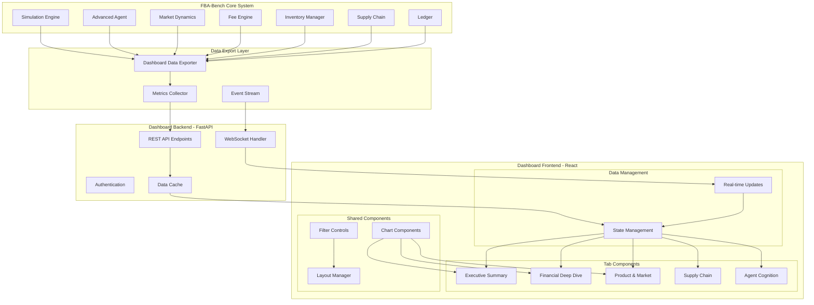

# FBA-Bench Integrated Analysis Dashboard - Architecture Plan

## Technology Stack Selection

**Backend**: FastAPI (Python) - seamless integration with existing FBA-Bench codebase
**Frontend**: React + TypeScript - modern, component-based dashboard architecture
**Charts**: Recharts - React-native charting library for interactive visualizations
**Real-time**: WebSocket for live simulation updates
**State Management**: Zustand - lightweight state management for React

## Architecture Overview

## Key Design Decisions

### 1. Non-Invasive Integration
- Add data export layer without modifying core simulation logic
- Preserve existing FBA-Bench functionality and performance
- Use observer pattern for real-time data collection

### 2. Modular Dashboard Architecture
- Each tab as independent React component
- Shared component library for charts, filters, and layouts
- Centralized state management for cross-tab data sharing

### 3. Real-time Data Flow
- WebSocket streams for live updates during simulation
- Backend caching layer for performance optimization
- Efficient data serialization for minimal network overhead

### 4. Responsive Design Strategy
- Mobile-first approach with progressive enhancement
- Adaptive layouts for different screen sizes
- Touch-friendly interactions for tablet/mobile use

## Data Models and API Endpoints

### Core Data Structures
- **SimulationState**: Current simulation status and metrics
- **FinancialMetrics**: P&L, cash flow, fee breakdowns
- **ProductMetrics**: BSR components, sales velocity, inventory
- **MarketData**: Competitor analysis, market conditions
- **AgentState**: Goal stack, memory, strategic plan
- **SupplyChainData**: Supplier status, order pipeline

### REST API Endpoints
- `GET /api/simulation/status` - Current simulation state
- `GET /api/financial/summary` - Financial overview
- `GET /api/financial/detailed` - Detailed P&L and fees
- `GET /api/products/{asin}` - Product-specific metrics
- `GET /api/market/competitors` - Competitor analysis
- `GET /api/agent/cognition` - Agent internal state
- `GET /api/supply-chain/overview` - Supply chain status

### WebSocket Events
- `simulation_update` - Real-time simulation state changes
- `financial_update` - Financial metrics updates
- `market_update` - Market condition changes
- `agent_action` - Agent decision events

## Implementation Phases

### Phase 1: Foundation (Backend)
1. Data export layer implementation
2. FastAPI backend setup
3. Core REST endpoints
4. WebSocket infrastructure

### Phase 2: Core Dashboard (Frontend)
1. React TypeScript project setup
2. Tab 1: Executive Summary
3. Basic chart components
4. Real-time data integration

### Phase 3: Detailed Views
1. Tab 2: Financial Deep Dive
2. Tab 3: Product & Market Analysis
3. Advanced chart interactions
4. Filtering capabilities

### Phase 4: Advanced Features
1. Tab 4: Supply Chain & Operations
2. Tab 5: Agent Cognition & Strategy
3. Data export functionality
4. Dashboard customization

### Phase 5: Polish & Deployment
1. Responsive design optimization
2. Error handling and loading states
3. Performance optimization
4. Documentation and deployment

## Technical Specifications

### Dependencies
**Backend**:
- fastapi>=0.104.0
- uvicorn>=0.24.0
- websockets>=12.0
- pydantic>=2.5.0

**Frontend**:
- react>=18.2.0
- typescript>=5.0.0
- echarts>=5.4.0 (Apache ECharts for powerful, real-time charts)
- echarts-for-react>=3.0.0
- zustand>=4.4.0
- tailwindcss>=3.3.0

**Alternative Charting**: Recharts as fallback option for simpler chart requirements

### Performance Considerations
- **Backend Caching**: In-memory cache with 1-second TTL for single-user scenarios
- **Data Validation**: Pydantic models for automatic API schema validation and serialization
- **Frontend Optimization**: Virtual scrolling for large datasets
- **Real-time Updates**: Debounced WebSocket updates to prevent UI flooding
- **Lazy Loading**: Non-visible tab content loaded on demand
- **Future Scalability**: Redis caching consideration for multi-user deployments

### Security & Authentication
- JWT-based authentication for multi-user scenarios
- CORS configuration for development/production
- Input validation and sanitization
- Rate limiting for API endpoints

This architecture provides a scalable, maintainable foundation for the FBA-Bench Integrated Analysis Dashboard while preserving the existing simulation system's integrity and performance.